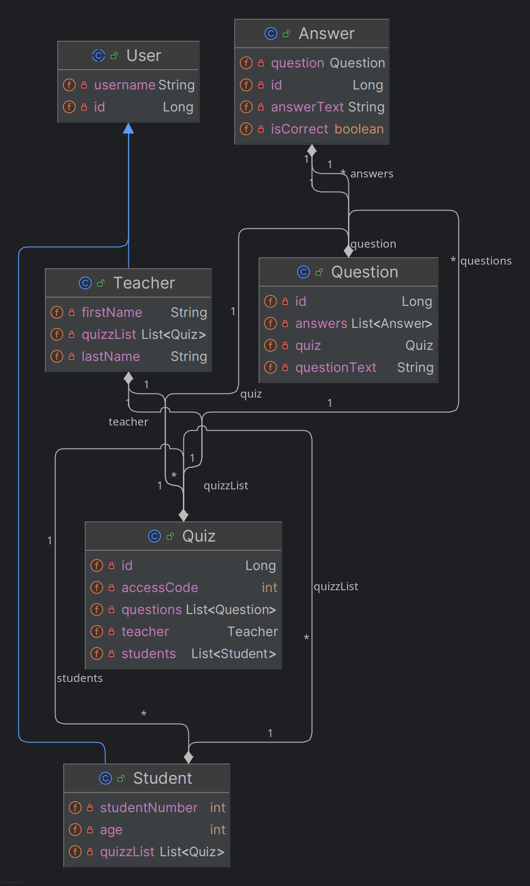

# TP TAA

## Auteurs
Stepan Tyurin, Yvan Douis - M2 IL Classique.

## TP2 - JaxRS et OpenAPI
Ce repo correspond au TP2 après la partie servlets (Partie 2 JaxRS et OpenAPI).

Ce projet reutilise les mêmes DAO et entités que la partie précédente mais ajoute des DTO,
une couche Service et une couche Rest pour accéder aux données. MapStruct est utilisé pour
mapper les entités aux DTO. Nous n'avons pas pu intégrer Lombok à cause des problèmes que nous
avons rencontrés liés aux MapStruct (attributs non trouvables etc) mais nous utilisons bien 
Lombok dans le TP Spring.

### Tester le résultat
Pour tester, démarrer d'abord le serveur de BDD:
```shell
./run-hsqldb-server.sh
```

Ensuite, il faut build le projet Maven et lancer [RestServer.java](src/main/java/fr/istic/taa/jaxrs/RestServer.java).

La BDD initiale est vide, mais il est possible d'ajouter des entrées avec des requêtes POST
et les retrouver avec des requêtes GET ou bien en regardant directement dans le navigateur,
par exemple avec http://localhost:8080/teacher/ pour la liste des professeurs, http://localhost:8080/student/ pour la liste
des étudiants, etc. Il y a également la recherche par Id, par exemple http://localhost:8080/teacher/1

### Requêtes de test
Requêtes de test peuvent être trouvés dans le fichier [requests.md](requests.md).

### Documentation OpenAPI
Le projet utilise des annotations OpenAPI pour donner une documentation des ressources REST. 
Cette documentation peut être visualisée sur http://localhost:8080/api/. Notez que seules l'entité
Answer a une documentation bien detaillé avec des descriptions etc.

### Explication correspondance TP / repo / branch
Les différents TP et parties de TP sont un peu partout, mais pour faire simple :
- TP1 - JPA sur le premier [repo gitlab](https://gitlab2.istic.univ-rennes1.fr/styurin/tp-1-jpa-taa-m-2/-/tree/main?ref_type=heads) .
- TP2 - Partie **Servlet** sur la branch [TP2 du premier repo gitlab](https://gitlab2.istic.univ-rennes1.fr/styurin/tp-1-jpa-taa-m-2/-/tree/TP2?ref_type=heads) `git checkout TP2`.
- TP2 - Partie **Rest** sur un [nouveau repo github](https://github.com/sanstepon5/JaxRSOpenAPI) avec Jax et OpenAPI (vous êtes dessus).
- TP3 sur le [deuxieme repo gitlab](https://gitlab2.istic.univ-rennes1.fr/styurin/taa-spring) ce qui contient donc tout le TP Spring
- TP4 sur la branche TP4 du [même repo que le TP3](https://gitlab2.istic.univ-rennes1.fr/styurin/taa-spring) qui contient donc la partie sur l'application de Keycloak sur le projet Kahoot.

Tous les liens ici redirigent vers les bons repos/branches.

### Explication diagramme UML
Tous les TP se basent sur le même schéma de données représentant un système "Kahoot".



On a fait un diagramme UML en commun avec le groupe d'Axel et Yann (parce que ce n'est pas la chose la plus fun à faire)
Peu de chose ont changé entre le diagramme et la DAO à part quelque noms. 
Le diagramme contient de l'héritage dans la relation User, Student et Teacher. 
Le diagramme est simple, mais on aurait dû faire moins de paramètres puisque j'ai l'impression qu'après cela, on a beaucoups trop remplis toutes les classes
qui sont de toute manière là pour tester la structure et pas le contenu en soi.

